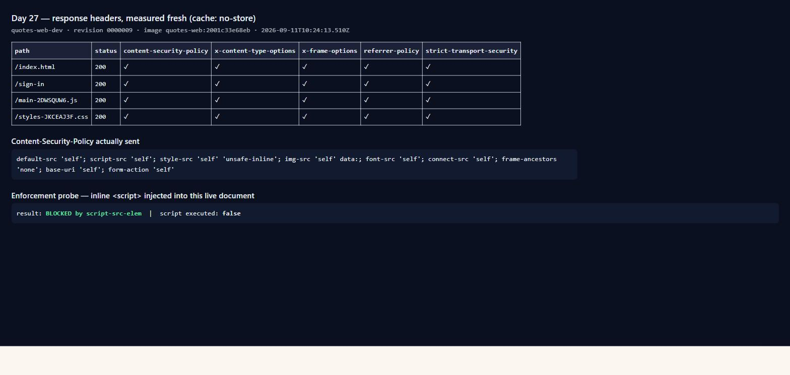

# Day 27 — verification: CSP in a browser, and the ZAP baseline

The plan named the browser check as the one gate no test can stand in for:
*"Open the SPA in a browser — CSP breaks front ends silently."* A policy that
is too strict fails no build, no health check and none of the 258 tests. It
blanks the page for the user and nothing else notices.

Everything below was measured against **dev**. Where a number is quoted, the
command that produced it is quoted with it.

---

## 1. Content-Security-Policy

### The false start, recorded because it is the useful part

The first attempt reported this as passing. It was not. The sequence was:

1. Headers were added to **QuotesApi** — the wrong origin. The API returns
   JSON, and a Content-Security-Policy on a JSON body governs no document.
   The page that loads and executes the application is served by nginx from
   `quotes-web`, and the browser never contacts the API directly at all
   (nginx reverse-proxies `/api/` from the same origin).
2. After moving the headers to nginx and deploying, an inline-script probe
   reported `BLOCKED`. That was accepted as proof. It was not proof: the
   document under test had been loaded minutes earlier, and a later fetch of
   `/index.html` showed **no CSP header at all**.
3. The cause was not the config. `day24-web-deploy #5` built and pushed
   `quotes-web:2001c33e68eb`, but the container app was running
   `quotes-web:7237990eec18` — an older, unrelated image
   (`sha256:523af295…` versus `sha256:261f3f72…`; the two tags are confirmed
   distinct manifests). Rolling the app onto the tag the pipeline built made
   every header appear at once.

Two lessons, both of which changed how the rest of this was measured: a
`BLOCKED` result from a document loaded at an unknown time proves nothing, and
`--top 1` ordered by push time is not "the image we just built" — an attempt to
fix this by rolling onto the newest tag rolled the app backwards a second time.

### What is true now

Measured with `fetch(path, {cache: 'no-store'})` so nothing came from cache,
against revision `quotes-web-dev--0000009`, image `quotes-web:2001c33e68eb`:



| path | CSP | nosniff | X-Frame-Options | Referrer-Policy | HSTS |
|---|---|---|---|---|---|
| `/index.html` | ✓ | ✓ | ✓ | ✓ | ✓ |
| `/sign-in` | ✓ | ✓ | ✓ | ✓ | ✓ |
| `/main-2DWSQUW6.js` | ✓ | ✓ | ✓ | ✓ | ✓ |
| `/styles-JKCEAJ3F.css` | ✓ | ✓ | ✓ | ✓ | ✓ |

The `.js` and `.css` rows matter as much as the document row. They are served
by a different nginx location block, and nginx does not merge `add_header`
across levels: a block declaring any `add_header` of its own inherits none from
its parent. Both such blocks exist here, so headers declared only at server
level would have covered everything **except** `index.html` and every script
chunk — silently, with the config loading cleanly. That is why the same file is
included three times.

### It enforces, not just announces

A header in a response is not a defence. The policy was tested by attempting
the attack it exists to stop — injecting an inline `<script>` into the live
document:

```js
const s = document.createElement('script');
s.textContent = 'window.__p5 = 1;';
document.head.appendChild(s);
```

```
result: BLOCKED by script-src-elem
script executed: false
```

`window.__p5` was never set. This is the reflected/stored XSS case: an attacker
who gets script *text* onto the page still cannot get it *run*.

**One result deliberately not claimed.** The same probe reported `eval
ALLOWED`. That is not evidence about this policy — the probe ran through a
browser extension, in an isolated world where the page's CSP does not apply.
The inline-script result counts because it created a real element in the page's
own DOM. Reporting the other would have been a fabricated finding.

### It did not break anything


Fifteen application requests, every one `200` — document, hero image, twelve
chunks, stylesheet. The console carried eighteen messages, **all eighteen from
a browser extension** (`MetaMask` content script). The application logged
nothing. That also accounts for the single error badge visible in DevTools
before any of this work: it was never ours.

`style-src` keeps `'unsafe-inline'` and `script-src` does not. Angular injects
component styles at runtime, so removing it blanks the app; script has no such
need, and script is the half that stops injected code.

---

## 2. OWASP ZAP baseline

```
docker run --rm -v C:\thinkschool\Day27\verification:/zap/wrk/:rw \
  ghcr.io/zaproxy/zaproxy:stable zap-baseline.py -t <target> -r <report> -I
```

Run against dev only. Never against prod, whose error-rate alert is live and
would fire on a scan.

**An earlier web run is discarded rather than reported.** It executed while the
app was on the wrong image, and its results cannot be reconciled with that
image's contents. It was repeated against a known revision instead. A report
whose target cannot be identified is not evidence.

### Results

| Target | FAIL | WARN | PASS |
|---|---|---|---|
| `quotes-web-dev` | 0 | 6 | 61 |
| `quotes-api-dev` (`/health`) | 0 | 4 | 63 |

The API was targeted at `/health` because its root is a genuine 404 — the SPA
does not live there — and ZAP's spider stops on a non-200 seed.

Both scans needed the app warmed first. `minReplicas: 0` means the first
request pays a cold start, and ZAP's spider times out on it: `Job spider failed
to access URL … Read timed out`. Three `curl` requests before the scan is the
whole fix, and it is worth writing down because the failure looks like an
unreachable host rather than a sleeping one.

### Every finding, with a verdict

A ZAP report pasted without verdicts is not a pen test result.

| # | Finding | Where | Verdict |
|---|---|---|---|
| 10035 | Strict-Transport-Security not set | API | **Fixed.** Real, and the best find of the scan — see below. |
| 10036 | Server leaks version information | web | **Fixed.** `server_tokens off`. nginx announced its patch level on every response, which tells an attacker which CVEs to try first. |
| 90004 | Cross-Origin-Resource-Policy missing | API | **Fixed.** `Cross-Origin-Resource-Policy: same-origin`. Nothing legitimate embeds this API cross-origin. |
| 90004 | Cross-Origin-Embedder-Policy missing | web | **Partly fixed, partly refused.** COOP and CORP added, both `same-origin`. COEP `require-corp` deliberately not set: it demands every subresource opt in, buys nothing without SharedArrayBuffer, and its failure mode is resources silently not loading. Adding a header because a scanner named it, at the risk of blanking the app, is how a security pass makes a site worse. |
| 10015 | Re-examine cache-control directives | both | **Accepted.** `index.html` is `no-cache` on purpose — it names the current chunk hashes, and caching it produces a 404 storm after every deploy. It contains no user data. |
| 10049 | Storable and cacheable content | web | **Accepted.** The flagged files are fingerprinted assets served `immutable` by design; the filename changes when the content does. |
| 10049 | Non-storable content | API | **False positive in context.** ZAP reports the observation, not a fault. An API that declines to be cached is behaving correctly. |
| 10055 | CSP: `style-src unsafe-inline` | web | **Accepted, with the cost stated.** Angular injects component styles at runtime; removing it blanks the application. It is a real weakening of the policy, and it is confined to styles — `script-src` has no such allowance. Removing it is a front-end change (nonces or extracted styles), not a header change. |
| 10109 | Modern web application | web | **Informational.** ZAP noting that the site is a SPA, so links may be JavaScript-driven. Not a vulnerability. |

### The one worth the whole exercise

```
WARN-NEW: Strict-Transport-Security Header Not Set [10035]
        https://quotes-api-dev…/health (200 OK)
```

The middleware set HSTS inside `if (context.Request.IsHttps)`. Azure Container
Apps terminates TLS at its ingress and forwards plain HTTP to the container, so
`IsHttps` is **false on every production request** and the condition was never
true in the one place it mattered.

The code read correctly and did nothing. No test could catch it: in-process
integration tests speak to Kestrel directly, where the request genuinely is
whatever the test says it is. It took a scanner talking to the deployed thing
over the real network. That is the argument for running a pen test at all,
and it is worth more than the finding itself.

The fix reads `X-Forwarded-Proto`, trusted for the same reason the rate limiter
trusts `X-Forwarded-For`: nothing reaches the container except through that
ingress.
