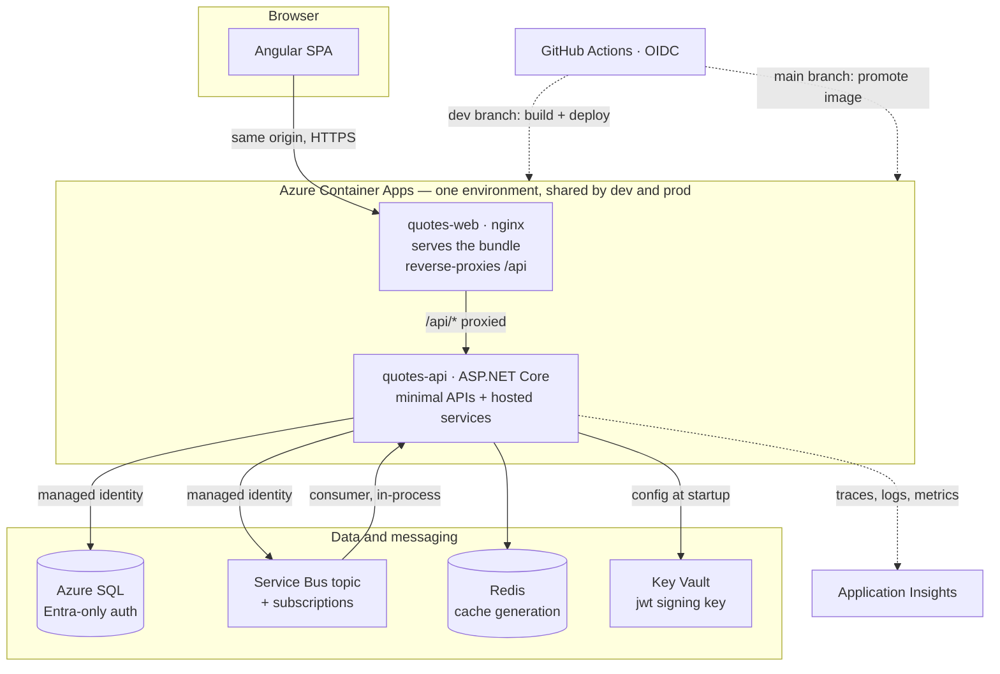

# Quotes — design brief

**Read this before the design review.** It describes the system as it runs
today, not as it was built. Nothing here is arranged by the day it was added,
because nobody inheriting this cares in what order it arrived.

Every structural claim traces to source in this repository or to a command in
`Day28/docs/day28-plan.md` §Step 0. Anything not yet re-confirmed against the
live deployment is marked **(to confirm)**.

---

## 1. What it does

Quotes is a small multi-tenant content service. A signed-in user creates and
searches quotes, groups them into private collections, and receives a curated
list; every write emits a domain event that downstream handlers use to keep an
audit trail and a search projection current.

It is deliberately ordinary in purpose and deliberately serious in
construction: the interesting parts are not the features but the guarantees —
that a write is never half-committed, that one user cannot reach another's
data, and that what runs in production is the artefact the tests passed on.

---

## 2. Shape of the system



**The browser talks to exactly one origin.** nginx serves the Angular bundle
and reverse-proxies `/api/*` to the API over the container environment's
internal path. There is no CORS preflight in the normal flow and no second
hostname for a user to see.

**Dev and prod share one Container Apps environment.** The subscription permits
exactly one, so the two environments are separated by resource group, registry,
database, identity and role assignment — not by network. This is the single
most consequential constraint on the design and it is why §7 reads the way it
does.

---

## 3. The write path, which is where the design lives

A write is one database transaction and nothing else:

```
POST /api/quotes
  └─ QuoteWriteService
       ├─ INSERT Quotes
       └─ INSERT OutboxMessages   ← same transaction, same commit
```

Publishing happens afterwards, out of band:

```
OutboxRelayService (hosted)
  ├─ claims a batch by writing LockOwner + LockedUntilUtc
  ├─ publishes to the Service Bus topic
  ├─ marks Sent, or increments Attempts and records LastError
  └─ OutboxRetentionService prunes what has been sent
```

Consumers run in the same process as a hosted service:

```
QuoteEventProcessorService
  ├─ ProcessedMessages table  → idempotency, at-least-once made safe
  ├─ MessageFailureClassifier → poison vs transient, decided explicitly
  ├─ AuditQuoteEventHandler        → QuoteAuditEntry
  └─ SearchIndexQuoteEventHandler  → QuoteSearchProjection
```

**Why this shape.** The alternative — commit the row, then publish — has a
window in which the row exists and the event does not, and no amount of retry
logic closes it, because the process can die inside the window. The outbox
moves the event into the same transaction as the data, so the two cannot
disagree. What it costs is a relay to run, at-least-once delivery, and
therefore consumers that must be idempotent. That trade is the subject of
**ADR-0001**, and it is the decision this review should push hardest on.

`traceparent` is written onto the outbox row and restored on the consumer side,
so one trace spans the HTTP request, the relay and the handler rather than
breaking into three unrelated fragments.

---

## 4. The read path

Reads do not go through the write model. `CollectionQueries` and the quote list
projections return read models shaped for the client, in one round trip, with
the ownership filter **inside the query**:

```csharp
.Where(c => c.Id == id && c.OwnerId == ownerId)
```

That placement is a security decision, not a performance one: a row belonging
to another user never leaves the database, so no present or future caller can
forget to check. Reads of somebody else's row answer `404`, not `403`, so the
API does not confirm which ids exist.

Quote lists are cached through `HybridQuoteListCache` — an in-process layer in
front of a distributed one, with stampede protection so a cold key does not
turn into a thundering herd. Invalidation is by **generation token** rather
than by key deletion: a write bumps a counter, and every key derived from the
old generation becomes unreachable at once. When Redis is unavailable the cache
degrades to pass-through and the request still succeeds; the app logs that
other instances may serve stale lists until entries expire, and keeps serving.

---

## 5. Identity and authorization

| Layer | What it does |
|---|---|
| Two authentication schemes | `CustomJwt` (own tokens, key from Key Vault) and Entra. `AuthSchemeSelector` picks per request. |
| Scope claims | `ScopeClaimsTransformation` normalises scopes into claims the policies can read |
| Policies | `can-read-quotes`, `can-read-collections`, `can-edit-collections` — capability, not ownership |
| Ownership | Enforced per resource: in the query on reads, by explicit comparison on writes, and by `MustOwnQuoteRequirement` where a requirement fits |
| Refresh tokens | Persisted, rotated by `RefreshTokenService` |

**The distinction that matters, because getting it wrong was this system's one
real vulnerability:** a scope policy answers *may this caller edit
collections*, which the token knows. It cannot answer *may this caller edit
**this** collection*, which only the loaded row knows. Three endpoints once
shipped with only the first, and sixty integration tests passed while any user
could read another user's collections — because every test acted as a single
user. The fix moved ownership into the query and added cross-user tests with a
positive control.

**Two live schemes is debt, recorded as such.** It doubles the token-validation
surface. Retiring `CustomJwt` means migrating the SPA to MSAL and reworking
sign-in, refresh and the `Users` table — a day of its own, scheduled rather
than pretended away.

---

## 6. Resilience, and what happens when something is down

| Dependency | Behaviour when it fails |
|---|---|
| Redis | Cache degrades to pass-through; requests still served; logged, not swallowed silently |
| Service Bus | Writes still commit — the event waits in the outbox and the relay drains it later |
| A poison message | Classified explicitly, dead-lettered after `MaxDeliveryCount` 5 rather than abandoned in a loop |
| A slow dependency | Polly pipelines with a circuit breaker per named pipeline; `IdempotencyPredicate` decides what may be retried |
| The database | Health check reports it; the app does not pretend to be healthy without it |

`CircuitBreakerRegistry` exposes breaker state so an operator can see whether a
breaker is open rather than inferring it from error rates.

---

## 7. Security posture

**Identity everywhere, credentials nowhere.** Managed identity to SQL, Service
Bus, Key Vault and Application Insights. `azureADOnlyAuthentication` on SQL, so
no SQL password exists to steal. `disableLocalAuth` on Service Bus, so SAS
strings are rejected. ACR admin user off. The JWT signing key is written into
Key Vault by an operator and never appears in a template, a parameter file or a
deployment log.

**The data tier is on the public network path, and this is the load-bearing
compromise.** Private endpoints require the API to sit inside a VNet; Container
Apps VNet integration is fixed at environment creation, this environment is
Consumption-only, and the subscription permits exactly one environment. The
door is closed by measurement, not by preference.

What defends SQL instead: Entra-only authentication, plus exactly one firewall
rule naming the container apps' current outbound address. **That makes
`azureADOnlyAuthentication` a single point of prevention** — one setting change
removes the wall, and nothing currently alerts on it. That alert is the highest
priority item in the build plan.

The firewall rule is reconciled by `Day27/scripts/01-reconcile-sql-firewall.ps1`
rather than pinned, because a Consumption environment does not guarantee its
egress address — a lesson learned the hard way when it moved and every
container stopped booting while the deployment stayed green.

**At the edge:** security headers on both origins — CSP with `script-src
'self'` and no inline scripts, `nosniff`, frame-deny, referrer policy, HSTS,
COOP/CORP. Rate limits of 10/min on `/auth` and 300/min globally, with health
probes exempt. Kestrel refuses bodies over 64 KB and headers over 32 KB before
the application sees them.

**Diagnostics endpoints do not exist in production.** They are gated by
*registration*, not authorization: `MapDiagnosticsEndpoints` returns without
mapping a route unless the environment is Development or the flag is set. That
is stronger than an auth check, because no credential can reach a route that
was never added.

---

## 8. Observability

Serilog with a correlation id assigned by `CorrelationIdMiddleware` and carried
on every log line. OpenTelemetry through `QuotesActivitySource`, exported to
Application Insights, with the consumer span exported as `ActivityKind.Consumer`
so a distributed trace stitches API → relay → worker into one operation.
`DbCommandCounterInterceptor` counts SQL round trips, which is how N+1 claims
get settled with a number instead of an opinion. Cache, outbox and resilience
each expose their own metrics, and `/api/outbox/status` and `/api/cache/stats`
are mapped in **every** environment — they are what an operator reads when they
suspect the relay or the cache has stopped, and that suspicion does not arise
in Development.

An error-rate alert is live on prod.

---

## 9. How code reaches production

```
feature branch ──PR──▶ dev ──▶ builds image, deploys dev
                        │
                        └──PR (rebase)──▶ main ──▶ promotes THAT image to prod
```

**Production never compiles.** `az acr import` copies the manifest dev already
built and tested from one registry to the other, so the bytes running in prod
are the bytes the tests passed on. A rebuild would ship a different binary —
different base layer, different SDK patch, different restored packages — and
the green tick would describe an artefact that was thrown away.

The promotion refuses any tag the dev registry does not hold, which is exactly
the question "was this commit tested and deployed to dev". Authentication is
OIDC with no stored secret; roles are scoped per environment and per resource,
so the dev pipeline cannot touch prod and neither can delete a registry.

Prod runs `minReplicas: 0` and the database auto-pauses, deliberately: it is
kept permanently deployable rather than permanently expensive, and the deploy
pipeline understands that a scaled-to-zero app is healthy rather than failed.

---

## 10. Where this design is weak

Written here, before the review, because a review spent discovering these is a
review that never got to judge them.

| Weakness | Status |
|---|---|
| No private endpoint; one setting is the wall in front of SQL | Accepted, measured — but **no alert on that setting**, which is the real gap |
| Egress address is reconciled by a script an operator runs | The detector for a moved address is still "the app crash-loops" |
| Two authentication schemes live at once | Debt, scheduled, not hidden |
| Per-IP rate limiting only | A speed bump. Many addresses, many buckets. Per-account lockout rejected as its own denial of service |
| `style-src 'unsafe-inline'` | Angular injects styles at runtime; the CSP is weaker for styles than for script, by choice |
| `SQLitePCLRaw` NU1903 | Transitive; production uses SQL Server, so exposure is low and the warning is still real |
| Search projection is a table, not a search engine | Fine at this size; would not survive real search requirements |
| Consumers run in the API process | Simple and cheap; couples worker throughput to API scaling |

---

## 11. Out of scope

Multi-region, tenancy beyond per-user ownership, real full-text search,
per-account lockout, private networking (impossible here, §7), and anything
requiring a second Container Apps environment.

---

## 12. What the review should decide

1. Is the outbox worth its complexity for this domain, or is publish-with-retry
   enough? (**ADR-0001**)
2. Is deferring the `CustomJwt` retirement right, or is it debt with interest?
3. With no private endpoint possible, would you ship this data tier?
4. Does `404`-on-foreign-row cost more in debuggability than it buys in
   enumeration resistance?
5. What here would you refuse to be on call for?
